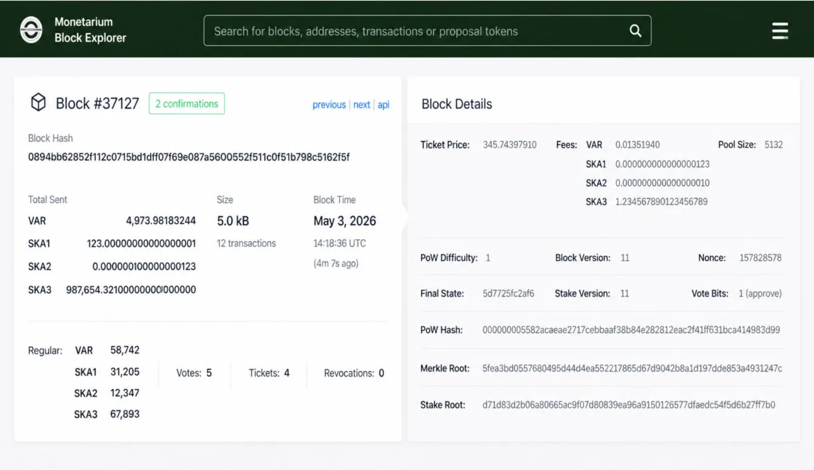
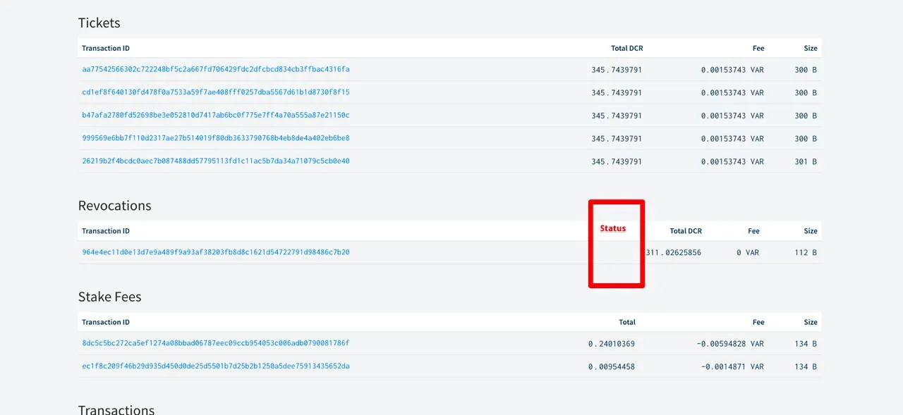
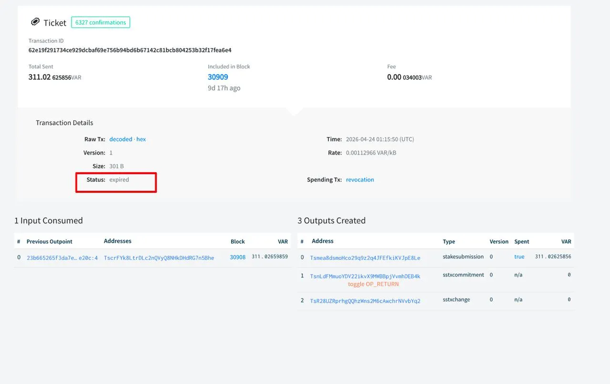

# Block Page — UI Change Requirements

## 1. Карточки вверху страницы

### 1.1. Final UI (Source of Truth)



**Описание:** согласованный с заказчиком финальный вариант **карточек вверху страницы**.  
Скриншот является визуальным референсом **только для верхних карточек (Block Card и Block Details)**.

Изменения для остальных частей страницы (таблицы) описаны текстом ниже.

**Правило приоритета**: в случае расхождения между скриншотом и текстовыми требованиями  
приоритет имеют текстовые требования.
---

### 1.2. Scope of Changes

**Входит:**
- изменение отображения значений по типам монет (VAR / SKA)
- обновление карточек:
  - Block Card
  - Block Details

**Не входит:**
- изменение общей структуры страницы
- добавление новых блоков

---

### 1.3. Общие правила отображения монет

- **Порядок отображения:**
  1. VAR
  2. SKA1, SKA2, …

- **Условное отображение:**
  - SKA отображаются только если присутствуют в блоке
  - Нулевые значения SKA не отображаются

- **Форматирование:**
  - VAR — 8 знаков после запятой
  - SKA — 18 знаков после запятой
  - SKA значения отображаются как строки (без преобразования в float)

---

### 1.4. Block Card (верхняя левая карточка)

#### Total Sent

**Текущее поведение:**
Отображается одна строка `Total Sent` в VAR.

**Требуемое поведение:**
Отображается вертикальный список значений по типам монет.

**Правила отображения:**
- формат — вертикальный список
- порядок — см. раздел “Общие правила отображения монет”
- `Mixed` удаляется из UI

**Пример:**
```

Total Sent

VAR   4,973.98183244
SKA1  123.000000000000000001
SKA2  0.000000000000000123

```

**UI reference:** см. Final UI (раздел 1.1)

---

#### Счётчик типов транзакций (Regular)

**Текущее поведение:**
Отображается одна строка: `Regular: 6`.

**Требуемое поведение:**
При наличии нескольких типов монет отображается вертикальная разбивка.

**Правила отображения:**
```

Regular:  VAR   12,345
SKA1  8,921
SKA2  70,002

```

- список выравнивается вертикально
- используется моноширинный шрифт для чисел
- значения отображаются с разделителями тысяч
- порядок — см. “Общие правила отображения монет”

**Важно:**
- Votes, Tickets, Revocations:
  - не изменяются (всегда VAR)
  - располагаются на одном уровне с VAR

> ⚠️ Примечание: текущее расположение этих элементов на скриншоте (см. Final UI) **не является актуальным**.  
> Следовать требованиям, описанным в этом разделе.

---

### 1.5. Block Details (правая верхняя карточка)

#### Fees (все типы монет)

**Текущее поведение:**
Отображается одна строка `Fees` только для VAR.

**Требуемое поведение:**
Отображается вертикальный список комиссий по типам монет внутри той же ячейки.

**Правила отображения:**
```

Fees: VAR   0.01367045
SKA1  12.000000000000000123
SKA2  0.500000000000000000

```

- формат — вертикальный список
- порядок — см. “Общие правила отображения монет”
- отображение остаётся внутри текущей карточки
- не добавлять новые колонки
- не создавать отдельную таблицу

**UI reference:** см. Final UI (раздел 1.1)

---

## 2. Таблица Block Reward

**Изменение:**
- `Total DCR` → `Total VAR`

---

## 3. Таблица Votes

**Изменение:**
- `Total DCR` → `Total VAR`

---

## 4. Таблица Tickets

**Изменение:**
- `Total DCR` → `Total VAR`

---

## 5. Таблица Revocations

**Изменение:**
- `Total DCR` → `Total VAR`

**Добавление:**
- добавить колонку `Status` . В этой колонке будет отображаться причина Revocation. Данные о причине Revocation (в добавляемом столбце таблицы Revocation) повторяют значение Status на странице `Ticket` (странице билета, который возвращается в транзакции Revocation) .

---

## 6. Таблица Stake Fees

**Требуемое поведение:**
- для колонок `Total` и `Fee` добавить суффикс типа монеты

**Пример:**
```

0.02608455 VAR
0.0067597 SKA1

```

---

## 7. Таблица Transactions

**Удаление:**
- `Mixed` удаляется

**Изменение:**
- `Total DCR` → `Total`

- Total:
  - добавить суффикс типа монеты (`VAR`, `SKA1`, …)

- Fee:
  - уже содержит суффикс → без изменений

- Fee Rate:
  - без изменений (`atoms/B`)

**Итоговый порядок колонок:**
```

Transaction ID | Total | Fee | Fee Rate | Size

```
